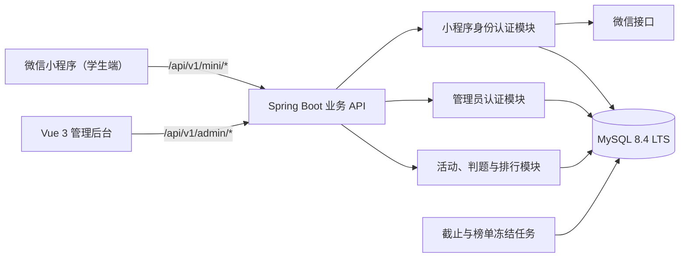

# Soft Energy Leaderboard 技术架构文档

> 文档状态：应用技术栈已冻结，首次上线基础设施按实际资源调整（V0.7）
> 创建日期：2026-07-26  
> 最近更新：2026-09-29
> 适用范围：微信小程序、Web 管理后台、服务端与数据库

## 1. 技术结论

本项目应用技术栈正式确定为“微信原生小程序 + Vue 3 管理后台 + Java 21 / Spring Boot 3.5.16 模块化单体后端 + MySQL”。本地集成测试继续以 MySQL 8.4 为目标基线；当前服务器使用 MySQL 8.0.46 完成首次上线，Flyway V1—V4 已保持 8.0/8.4 兼容，后续可迁移 RDS MySQL。

| 层级 | 推荐技术 | 选择原因 |
| --- | --- | --- |
| 学生客户端 | 微信原生小程序、TypeScript、TDesign Miniprogram、自定义国学主题 | 直接使用微信原生登录和手机号能力，国学视觉通过项目主题层实现 |
| 管理后台 | Vue 3、TypeScript、Vite、Element Plus、Vue Router、Pinia、Axios、ECharts | 完成活动表单、用户表格、答题统计和少量必要图表 |
| 服务端 | Java 21 LTS、Spring Boot 3.5.16、Maven、Spring Web、Spring Security、Bean Validation、Spring Scheduling、springdoc-openapi | 负责小程序和管理员认证、活动、判题、排行、统计和审计 |
| 数据访问 | Spring Data JPA、Flyway、必要时使用原生 SQL | 用 JPA 管理实体关系和事务，用 Flyway 管理版本化表结构，复杂排行榜查询允许使用可测试的原生 SQL |
| 主数据库 | MySQL 8.0.46（当前生产）/ 8.4（本地目标与未来 RDS）、InnoDB、`utf8mb4` | 当前以可用服务器完成上线，同时保持迁移文件跨 8.0/8.4 兼容 |
| 缓存/队列 | 首版不引入 Redis | 当前规模未知，MySQL 足以支撑首版；确有并发或异步任务压力时再增加，避免过度设计 |
| 文件存储 | 首版不建设独立文件系统 | 首版题目使用文本和外部已授权图片地址，MySQL 不保存文件二进制 |
| 部署 | 阿里云 ECS、Alibaba Cloud Linux 3、Jenkins LTS、systemd、Nginx、HTTPS、同机 MySQL | Jenkins 构建和发布；systemd 托管 Java/MySQL；Nginx 托管管理后台并反代 API；未来可迁移 RDS |
| 源码与协作 | GitHub 公开仓库；未来多人协作时迁移 Organization | Jenkins 当前匿名只读拉取；改为私有仓库后使用最小权限 GitHub App |

版本策略：后端固定使用 Java 21 LTS 和 Spring Boot 3.5.16；数据库迁移必须同时兼容当前生产 MySQL 8.0.46 和目标 MySQL 8.4；前端依赖通过 `pnpm-lock.yaml` 锁定。升级只能单独提出、验证并记录，不能在功能开发中顺手升级主框架。

本机环境核验结果（2026-07-26）：

- 默认 JDK：17.0.19 LTS；
- 另有 JDK：21.0.11 LTS，路径为 `D:\Java\JDK-21\jdk-21.0.11+10`；
- Maven：3.9.16；
- Python：3.12、3.13；
- Node.js：24.18.0；
- MySQL：8.0.45，Windows 服务正在运行；
- SQLite CLI：3.50.6，来源为 Android SDK；
- Docker 客户端已安装，但检查时 Docker Desktop 未启动。

开始 Java 开发前，需要把项目或 IDE 的 JDK 明确切换到 JDK 21；目前系统 `JAVA_HOME` 仍指向 JDK 17。本阶段不修改用户的全局环境变量。

本机现有 MySQL 8.0.45 只作为环境现状记录，不再作为项目数据库版本。开始开发时统一使用 Docker 中的 MySQL 8.4 LTS；执行前需要先启动 Docker Desktop，本阶段不启动或修改 Docker。

## 2. 为什么需要管理系统

管理系统是首版必要组成部分，不是可选功能，原因如下：

1. 标准答案不能放在小程序前端，必须由受保护的管理端录入并保存在服务端。
2. 管理员需要设置活动起止时间、判定规则和榜单公开方式。
3. 自动判定可能存在争议，需要查看原始答案和判定依据。
4. 用户资料、参与人数、冠军、亚军和未入榜数据需要集中统计。
5. 活动截止后的最终榜单需要冻结、复核和归档。

首版管理后台页面建议包括：

- 管理员登录；
- 数据概览；
- 答题活动列表；
- 创建/编辑活动；
- 活动详情与实时参与统计；
- 学生原始答案与判定结果；
- 冠军榜与亚军榜；
- 小程序用户列表与用户详情；
- 管理操作日志；
- 修改管理员密码。

## 3. 总体架构



采用一个后端服务，但必须划分两个互不混用的认证域：

- 小程序接口：`/api/v1/mini/*`，只接受小程序用户登录态；
- 管理接口：`/api/v1/admin/*`，只接受管理员登录态；
- 管理员和小程序用户使用不同数据表、不同登录接口、不同鉴权守卫；
- 管理员不需要绑定任何微信用户，也不能拿小程序令牌调用管理接口。

这不是微服务。首版采用模块化单体，可以减少部署和运维成本，同时通过模块边界避免代码和权限混乱。以后并发量上升时，再按实际瓶颈拆分判题或排行榜模块。

## 4. 项目目录建议

```text
soft-energy-leaderboard/
├─ miniprogram/          # 微信原生小程序、TypeScript
├─ admin-web/            # Vue 3 管理后台
├─ server/               # Java 21、Spring Boot 服务端
├─ database/
│  ├─ migrations/        # 数据库迁移
│  └─ seeds/             # 初始化管理员等受控种子数据
├─ deploy/               # 部署配置，正式密钥不得提交
└─ 开发文档/
```

小程序和管理后台分别维护前端依赖，但统一使用 `pnpm` 和锁文件。Java 服务端使用 Maven Wrapper，避免依赖开发者电脑中的 Maven 版本。前后端通过 OpenAPI 文档和明确的 DTO 字段约定协作，不为了共享少量类型而强行混合 Java 与 TypeScript 工程。

## 5. 微信小程序登录与用户资料

### 5.1 登录流程

1. 小程序调用 `wx.login` 获取一次性登录凭证 `code`。
2. 小程序把 `code` 发送给自己的服务端，而不是直接请求微信密钥接口。
3. 服务端使用小程序 `AppID`、`AppSecret` 和 `code` 调用微信 `code2Session`。
4. 微信返回该小程序下的 `openid`、会话信息以及条件满足时的 `unionid`。
5. 服务端按 `(appid, openid)` 查询或创建 `mini_users` 记录。
6. 服务端签发本系统自己的访问令牌，后续请求通过该令牌识别当前用户。

身份规则：

- `openid` 是当前小程序内的微信身份依据，但不直接作为所有业务表的主键；
- 系统生成内部 `user_id`，答题、成绩和排行只关联内部 `user_id`；
- `unionid` 只作为未来多应用统一身份的可选字段，未取得时不能阻塞登录；
- 手机号不是登录主键，也不能用手机号自动合并两个微信用户；
- 若同一手机号出现在不同微信身份上，只标记为待核查，禁止自动迁移答题数据。

### 5.2 手机号授权

微信登录与手机号授权是两个独立动作：

1. 用户点击手机号授权按钮并明确同意；
2. 小程序取得手机号授权专用 `code`；
3. 服务端调用微信手机号接口换取号码；
4. 服务端将号码标准化后加密保存；
5. 小程序个人中心可以查看当前用户自己的号码，管理列表默认只显示脱敏号码。

不能把手机号授权 `code` 与 `wx.login` 的登录 `code` 混用，也不能因为用户登录成功就假设已经取得手机号。

手机号是否为答题前的必填信息仍需业务确认。从个人信息最小化角度，建议仅在“识别真实学员确有必要”时要求授权，不应把手机号作为浏览题目的前置条件。

### 5.3 昵称、头像与展示名称

- 昵称、头像和展示名称均允许为空，不能作为用户唯一身份。
- 用户授权或主动填写后，保存当前资料快照并记录更新时间。
- 排行榜最终显示微信昵称、真实姓名还是管理员维护的学员名称，需业务确认。
- 如果业务必须识别真实学生，应新增独立 `display_name` 或学员档案字段，不能把可能变化的微信昵称当作真实姓名。

### 5.4 小程序个人中心

登录后建议展示：

- 头像；
- 昵称或展示名称；
- 本人手机号；
- 注册时间；
- 参与答题次数；
- 冠军次数；
- 亚军次数；
- 最近答题记录。

所有“我的资料、我的答案、我的成绩”接口均由服务端从登录令牌确定当前用户，前端不得通过传入任意 `user_id` 查询其他学生的数据。

## 6. 管理员登录方案

首版只保留一个默认管理员账号，但仍必须按生产安全标准实现：

- 默认用户名可设为 `admin`；
- 初始化密码由部署环境变量提供或在首次部署时随机生成，不在代码仓库中写死 `admin123` 等固定密码；
- 密码使用 Argon2id 保存强密码哈希，不保存明文或可逆密文；
- 首次登录强制修改初始化密码；
- 管理员登录令牌和小程序用户令牌使用不同的令牌受众、接口守卫和刷新记录；
- 连续登录失败需要限流和短期锁定；
- 记录登录时间、来源 IP、成功或失败状态；
- 管理端涉及查看完整手机号、复核答案、修改等级等操作时写入审计日志。

管理员账号表不包含 `mini_user_id`、`openid` 或手机号绑定字段。管理业务读取小程序用户数据属于后台管理权限，不代表两个账号发生绑定。

## 7. 数据库选择

### 7.1 结论

开发与测试以 MySQL 8.4 为目标基线，当前生产服务器使用 MySQL 8.0.46；迁移文件必须同时验证兼容性。不使用 MongoDB、SQLite、纯云开发集合，也不把业务数据直接存在小程序端。

当前数据天然存在强关系：

```text
一个小程序用户
  └─ 参加多场答题活动
       └─ 每场可能有多次提交
            └─ 每次提交产生一次判定
                 └─ 每场汇总出一个最终等级和排名
```

MySQL 的事务、外键、唯一约束和复合索引更适合保证这些关系不会混乱。MongoDB 并不能消除后端设计工作，反而需要额外维护跨集合一致性；当前没有选择它的业务收益。

SQLite 是嵌入式文件数据库，不需要像 MySQL 一样启动独立数据库服务。它适合临时原型、单机工具或极小型测试，但不适合作为本项目多人同时答题、事务排名和管理后台共享数据的正式数据库。为避免 MySQL 与 SQLite 在锁、时间、JSON 和 SQL 方言上的差异，首版集成测试也优先使用独立 MySQL 测试库；Docker 恢复后可再使用 Testcontainers 自动启动测试数据库。

### 7.2 数据库基础约定

- 存储引擎：InnoDB；
- 字符集：`utf8mb4`；
- 数据库时间统一保存 UTC，接口按用户所在时区转换展示；
- 排名时间精确到毫秒，类型使用 `DATETIME(3)`；
- 主表内部使用 `BIGINT UNSIGNED` 主键；
- 对外接口使用不可枚举的 `public_id`，不直接暴露连续自增主键；
- 所有正式表包含 `created_at`、`updated_at`，必要时包含 `deleted_at`；
- 生产环境通过迁移文件变更表结构，禁止启用 ORM 自动同步；
- 关键表使用外键、唯一索引和非空约束，不只依赖前端校验。

## 8. 核心数据表设计

以下为逻辑模型，字段类型和索引在正式数据库设计阶段进一步细化。

### 8.1 `mini_users` 小程序用户

| 字段 | 用途 |
| --- | --- |
| `id` | 内部用户主键，所有业务关联的唯一依据 |
| `public_id` | 对外不可枚举用户标识 |
| `appid` | 小程序 AppID，用于限定 OpenID 所属应用 |
| `openid` | 微信小程序用户标识 |
| `unionid` | 可空，仅为未来多应用统一身份预留 |
| `nickname` | 可空，用户昵称快照 |
| `avatar_url` | 可空，头像地址 |
| `display_name` | 可空，业务展示名称或真实学员名称 |
| `phone_ciphertext` | 可空，加密后的手机号 |
| `phone_hmac` | 可空，用于等值查找和重复号码提示，不存普通明文哈希 |
| `phone_last4` | 可空，用于管理列表脱敏展示 |
| `profile_updated_at` | 用户资料更新时间 |
| `last_login_at` | 最近登录时间 |
| `status` | 正常、停用等状态 |

关键约束：

- 唯一索引：`(appid, openid)`；
- `phone_hmac` 建普通索引但首版不做唯一约束，避免错误合并账号；
- 昵称、头像和手机号均不是主键。

### 8.2 `admin_users` 管理员

| 字段 | 用途 |
| --- | --- |
| `id` | 管理员主键 |
| `username` | 唯一登录名 |
| `password_hash` | 强密码哈希 |
| `force_password_change` | 是否强制首次修改密码 |
| `status` | 正常、锁定、停用 |
| `failed_login_count` | 连续失败次数 |
| `locked_until` | 锁定截止时间 |
| `last_login_at` | 最近登录时间 |

该表与 `mini_users` 无业务外键。

### 8.3 `quiz_activities` 答题活动

| 字段 | 用途 |
| --- | --- |
| `id` / `public_id` | 内部主键和对外标识 |
| `title` | 活动名称 |
| `status` | 草稿、已发布、进行中、已结束、已归档 |
| `start_at` / `end_at` | 开始和截止时间 |
| `deadline_mode` | `DURATION` 发布后按时长，或 `FIXED_TIME` 指定日期时间 |
| `duration_hours` | 按时长模式的整数小时数，默认12小时 |
| `result_publish_at` | 榜单公开时间 |
| `allow_resubmit` | 是否允许重复提交 |
| `feedback_mode` | 进行中只反馈等级或截止后公开答案 |
| `ranking_rule_version` | 排名规则版本 |
| `created_by` | 创建活动的管理员 |

新活动默认按实际发布时间开放12小时；管理员可输入1至720小时，或切换为指定起止日期时间。按时长模式在发布事务中用服务器时间重新计算 `start_at` 和 `end_at`，避免草稿停留时间侵占答题窗口。

### 8.4 `quiz_questions` 与 `quiz_answer_keys`

题目和标准答案拆表保存：

- `quiz_questions` 保存学生可以看到的题目内容；
- `quiz_answer_keys` 保存按上联、下联顺序分行的两句标准答案；
- 小程序查询题目时只读取 `quiz_questions`，DTO 和接口响应中不存在标准答案字段；
- 标准答案建议加密存储，只有管理模块和判题服务可以解密；
- 判定规则保存版本，避免老师修改标准答案后无法解释历史结果。

即使首版一场只有一道题，数据结构也建议保留一场多题的扩展能力，但小程序首版界面不必提前实现多题流程。

### 8.5 `quiz_submissions` 学生提交记录

| 字段 | 用途 |
| --- | --- |
| `id` / `public_id` | 提交记录标识 |
| `activity_id` / `question_id` | 所属活动和题目 |
| `user_id` | 当前登录小程序用户，由服务端写入 |
| `attempt_no` | 当前用户在该活动中的第几次提交 |
| `raw_answer` | 学生原始答案，不覆盖修改 |
| `normalized_answer` | 仅移除表情并统一换行后的答案，用于解释判定 |
| `judgment_level` | 自动判定为冠军、亚军或未入榜；历史待复核值仅为兼容保留 |
| `score` | 可空，后续需要细分时使用 |
| `judgment_detail` | 命中要点、顺序问题等结构化依据 |
| `rule_version` | 使用的判定规则版本 |
| `submitted_at` | 服务端接收成功时间，作为排名基础 |
| `idempotency_key` | 防止网络重试生成重复提交 |

提交记录采用追加方式保存，不能因为学生重答就覆盖旧答案。关键唯一约束建议包括：

- `(activity_id, user_id, attempt_no)`；
- `(user_id, idempotency_key)`；
- 排名查询索引：`(activity_id, judgment_level, submitted_at, id)`。

### 8.6 `activity_user_results` 每场用户最终结果

该表每场活动、每个用户只有一条，用于稳定保存当前最佳结果：

- 唯一约束：`(activity_id, user_id)`；
- `best_level`：当前最高等级；
- `ranking_time`：第一次达到当前最高等级的服务器时间；
- `best_submission_id`：产生当前结果的提交记录；
- `attempt_count`：提交次数；
- `is_finalized`：是否已经冻结。

每次提交时，在同一数据库事务内完成：

1. 写入不可变的提交记录；
2. 锁定并更新该用户的活动汇总记录；
3. 仅在等级提升时更新 `best_level` 和 `ranking_time`；
4. 保留原提交记录供管理员审计。

### 8.7 `leaderboard_entries` 最终榜单快照

活动截止后生成最终快照，字段至少包括：

- 活动、用户、冠军/亚军等级；
- 最终名次；
- 排名时间；
- 来源提交记录；
- 冻结时间；
- 榜单显示名称快照。

最终快照可以防止用户以后修改昵称、手机号或资料时导致历史榜单内容和名次发生变化。

### 8.8 日志与会话表

- `mini_user_sessions`：小程序刷新令牌摘要、过期和撤销状态；
- `admin_sessions`：管理员刷新令牌摘要、登录来源和撤销状态；
- `admin_audit_logs`：管理员查看敏感信息、修改判定、发布榜单等记录；
- `admin_login_logs`：登录成功、失败、IP 和时间。

小程序和管理员会话分表，避免令牌类型被错误复用。

## 9. 防止用户数据混乱的强制规则

1. 小程序提交答案的接口不接收可信 `user_id`；后端从已验证登录态读取用户身份。
2. 所有“我的数据”查询自动附加当前 `user_id` 条件，不提供任意用户编号查询入口。
3. 管理端查询学生数据走独立管理员接口和权限守卫。
4. 每张答题相关表都明确保存 `activity_id` 与 `user_id`，并建立外键和复合索引。
5. 重复提交使用幂等键，网络重试不能重复计数或改变排名时间。
6. 提交时间使用服务端时间，不能接受小程序设备上报的时间作为排名依据。
7. 更新最佳成绩使用数据库事务和行锁，两个并发请求不能相互覆盖。
8. 标准答案和判定规则带版本，修改规则后不能静默改变历史判定。
9. 活动截止判断以数据库中的 `end_at` 和服务端时间为准；即使冻结任务延迟，截止后的提交也不能进入榜单。
10. 最终榜单采用快照，后续个人资料变化不影响历史结果。
11. 手机号变更只更新资料，不更换内部 `user_id`，也不搬移历史答题记录。
12. 不按手机号自动合并用户；任何账号合并必须作为未来的独立人工流程设计。

开发时必须增加越权测试：用户 A 即使修改请求参数，也不能读取、覆盖或提交为用户 B 的答案。

## 10. 个人信息存储与展示

### 10.1 收集范围

当前建议只收集完成业务所必需的信息：

- 必需：微信小程序身份标识、系统内部用户 ID、答题和排名数据；
- 按业务需要并经授权：手机号；
- 用户主动提供：昵称、头像、展示名称；
- 安全与审计需要：登录时间、必要的设备或网络日志。

不收集身份证号、通讯录、精确位置、支付信息等当前业务不需要的数据。

### 10.2 手机号存储

手机号不建议直接明文落库，采用以下组合：

- `phone_ciphertext`：使用 AES-256-GCM 等认证加密算法保存；
- 加密密钥保存在部署密钥或云 KMS 中，不写入代码和数据库；
- `phone_hmac`：使用独立密钥计算 HMAC，用于等值查找和重复提示；
- `phone_last4`：用于无需解密的脱敏展示；
- 管理列表默认显示 `138****1234`，只有确有需要时查询完整号码，并写审计日志。

不使用普通 SHA-256 直接哈希手机号，因为手机号取值范围有限，普通哈希容易被枚举；HMAC 必须使用服务端独立密钥。

### 10.3 资料展示

- 小程序用户只能查看和修改自己的资料；
- 管理员可以查看用户统计，手机号列表默认脱敏；
- 排行榜只展示业务确认后的必要字段；
- 若展示真实姓名或完整头像，应在隐私说明中明确用途和公开范围；
- 用户注销、资料删除和数据保留期限需要在上线前形成规则。

个人信息处理应遵循目的明确、最小必要和最短保存期限原则。上线前需要准备隐私政策、授权提示、用户注销/删除申请流程和管理端数据导出控制。

## 11. 排行榜与截止处理

- 排名基于服务器记录的 `ranking_time`，冠军榜和亚军榜分别排序；
- 推荐排序字段：`ranking_time ASC, submission_id ASC`，保证毫秒相同仍有稳定顺序；
- 截止任务负责生成快照，但业务正确性不能依赖任务准点执行；
- 生成榜单时始终过滤 `submitted_at <= end_at` 的有效记录；
- 冻结过程放在事务中，并使用活动级状态或锁避免重复冻结；
- 人工复核发生在冻结前还是冻结后，以及是否重排，仍需业务确认。

首版不需要 Redis 排行榜。只有在单场人数、提交并发和实时榜单刷新量经压测证明 MySQL 不足时，才引入 Redis；MySQL 仍是最终事实来源。

## 12. API 边界草案

### 12.1 小程序接口

```text
POST /api/v1/mini/auth/login
POST /api/v1/mini/auth/phone
GET  /api/v1/mini/profile
PATCH /api/v1/mini/profile
GET  /api/v1/mini/activities/current
GET  /api/v1/mini/activities/:activityId
POST /api/v1/mini/activities/:activityId/submissions
GET  /api/v1/mini/activities/:activityId/my-result
GET  /api/v1/mini/activities/:activityId/leaderboard
```

### 12.2 管理接口

```text
POST /api/v1/admin/auth/login
POST /api/v1/admin/auth/change-password
GET  /api/v1/admin/dashboard
GET  /api/v1/admin/activities
POST /api/v1/admin/activities
PATCH /api/v1/admin/activities/:activityId
POST /api/v1/admin/activities/:activityId/publish
GET  /api/v1/admin/activities/:activityId/submissions
POST /api/v1/admin/submissions/:submissionId/review
GET  /api/v1/admin/activities/:activityId/leaderboard
GET  /api/v1/admin/users
GET  /api/v1/admin/users/:userId
```

上述只是边界草案，正式接口字段需要等判题规则、重复提交和榜单公开时机确认后编写接口文档。

## 13. 首版部署方案

当前首次上线环境为：

- 一台阿里云 ECS：Alibaba Cloud Linux 3、2 vCPU、4 GiB 内存、60 GiB ESSD 和 4 GiB Swap，承载 Jenkins、Nginx、Java 21 与 MySQL；
- MySQL 8.0.46 只监听 `127.0.0.1:3306`，数据库名固定为 `soft_energy_prod`；
- Nginx 仅公开 80/443，Java API 固定监听 `127.0.0.1:8081`，Jenkins 固定监听 `127.0.0.1:8080`；
- 已备案且可配置为微信小程序合法请求域名的 HTTPS 正式域名；
- 小程序 AppID 与 AppSecret；
- 数据库、令牌、手机号加密和 HMAC 独立密钥；
- MySQL 每日逻辑备份、ECS 外异地副本和定期恢复演练；迁移 RDS 后启用日志备份和时间点恢复；
- 阿里云云监控、Jenkins 构建记录、systemd 日志和 Nginx 访问/错误日志。

Jenkins、业务服务与 MySQL 首版部署在同一台 ECS，Jenkins 执行器固定为 1，避免构建并发抢占线上资源。生产应用不使用 Docker Compose；MySQL 由 systemd 托管并仅监听本机。开发电脑仍可通过 Docker 运行 MySQL 8.4，保证迁移文件对目标版本兼容。

完整目录、凭证、流水线、迁移、回滚、备份和小程序发布流程以 [部署与发布方案](./部署与发布方案.md) 为唯一执行说明。

生产环境不得：

- 把 AppSecret、数据库密码或加密密钥提交到 Git；
- 在小程序代码中调用需要 AppSecret 的微信服务端接口；
- 在生产环境使用 Hibernate `ddl-auto=create`、`create-drop` 或 `update` 自动修改表结构；
- 使用固定弱管理员密码；
- 把标准答案返回给活动进行中的小程序接口。

## 14. 当前不引入的复杂能力

- 微服务；
- Kubernetes；
- Redis 排行榜；
- 消息队列；
- 多租户；
- 多管理员角色权限；
- 支付和订单系统；
- 自动账号合并；
- 未确认规则前的 AI 判题服务。

这些能力不是永远不做，而是在出现明确业务需要或性能数据后再引入。

## 15. 最终技术栈锁定清单

### 15.1 微信小程序

- 微信原生小程序；
- TypeScript；
- TDesign Miniprogram；
- 微信开发者工具；
- `miniprogram-api-typings`；
- 自定义 `WXSS` 主题变量实现“当代东方书院”视觉；
- 小程序自身只负责展示与交互，所有身份、判题和排名以服务端为准。

### 15.2 管理后台

- Vue 3；
- TypeScript；
- Vite；
- Element Plus；
- Vue Router；
- Pinia；
- Axios；
- Apache ECharts；
- `pnpm` 管理依赖；
- 不使用现成大型 Admin 模板，从轻量登录页、侧栏和内容布局开始搭建。

### 15.3 Java 后端

- JDK 21 LTS；
- Spring Boot 3.5.16；
- Maven Wrapper；
- Spring Web；
- Spring Security；
- Spring Data JPA；
- Bean Validation；
- Spring Scheduling；
- Flyway；
- MySQL Connector/J；
- springdoc-openapi；
- Spring Security JWT/Nimbus JOSE JWT；
- Argon2id 管理员密码哈希；
- Spring Boot Actuator、Micrometer；
- JUnit 5、Mockito、Spring Boot Test、Testcontainers；
- JaCoCo、Spotless、Maven Enforcer。

服务端采用一个模块化单体项目。首版判题逻辑直接在 Java 服务内实现，不建立 Python 判题服务。

### 15.4 数据库

- MySQL 8.0.46 当前生产，并保持 MySQL 8.4 迁移兼容；
- InnoDB；
- `utf8mb4`；
- Flyway 迁移；
- 开发、测试和生产统一 MySQL；
- 排名时间保存到毫秒；
- 服务器时间统一保存 UTC。

### 15.5 部署

- 阿里云 ECS；
- Alibaba Cloud Linux 4；
- Jenkins LTS Pipeline；
- Java 21 API 以 systemd 服务运行；
- Nginx + HTTPS；
- Vue 管理后台构建为静态文件并由 Nginx 提供；
- 当前同机 MySQL，后续按业务量和可用性要求迁移阿里云 RDS；
- 当前 MySQL 自动逻辑备份、异地副本和发布前手动恢复点；
- GitHub 公开仓库管理代码；进入多人协作后迁移 Organization 并启用 Rulesets；
- Jenkins 当前匿名只读拉取公开仓库；仓库私有化后使用最小权限 GitHub App；
- 生产密钥通过服务器只读配置或 Jenkins Credentials 注入；
- 版本化发布目录、原子软链接切换、健康检查失败自动恢复上一应用版本；
- 生产不使用 Docker Compose，Docker 仅服务于本地 MySQL 开发环境。

### 15.6 明确不使用

- 不使用 Python/FastAPI 作为后端；
- 不使用 Node.js/NestJS 作为后端；
- 不使用 UniApp、Taro 或其他跨端框架；
- 不使用 React、Ant Design；
- 不使用 SQLite、MongoDB；
- 不使用 Redis；
- 不使用消息队列；
- 不使用微服务；
- 不使用 Kubernetes；
- 不使用大型通用 Admin 模板；
- 首版不建立独立 AI/NLP 服务。

## 16. 企业级工程基线

### 16.1 架构与代码边界

- 后端采用模块化单体，按 `auth`、`users`、`activities`、`questions`、`judging`、`submissions`、`leaderboard`、`admin`、`audit` 划分业务模块；
- 模块之间通过明确服务接口协作，不跨模块直接修改其他模块的数据；
- 管理员认证域与小程序用户认证域完全隔离；
- 接口统一使用 `/api/v1` 版本前缀；
- DTO、数据库实体和接口响应模型分开，禁止直接返回 JPA 实体；
- 所有异常使用统一错误码、用户可读信息和服务端追踪编号。

### 16.2 数据一致性

- 表结构只通过 Flyway 迁移，不依赖 Hibernate 自动改表；
- 用户、活动、提交和排行建立外键、唯一约束及必要复合索引；
- 重复提交使用幂等键；
- 最佳成绩更新使用事务与行锁；
- 排名使用服务器时间，统一存储 UTC；
- 截止榜单生成不可变快照；
- 每日自动备份，正式上线前至少完成一次恢复演练。

### 16.3 安全

- 密钥、AppSecret、数据库密码和手机号加密密钥全部通过环境变量或密钥服务注入；
- 管理员密码使用 Argon2id；
- 手机号使用认证加密并默认脱敏；
- 登录、提交和敏感查询增加限流及审计；
- 所有查询按当前登录身份限定数据范围，测试用户 A 不得访问用户 B 数据；
- 依赖升级前执行安全检查，不引入来源不明的组件包。

### 16.4 可观测性

- Spring Boot Actuator 提供健康状态；
- Micrometer 记录接口耗时、错误率、JVM 和数据库连接指标；
- 每个请求生成 `traceId`，接口错误、日志和管理端提示可以关联；
- 日志采用结构化格式，不输出完整手机号、令牌、标准答案和密钥；
- 登录失败、判题异常、榜单冻结失败和数据库异常需要产生告警。

### 16.5 测试与质量门禁

- Java：JUnit 5、Mockito、Spring Boot Test、Testcontainers、JaCoCo；
- 管理后台：TypeScript `strict`、ESLint、Prettier、Stylelint、Vitest、Playwright；
- 小程序：TypeScript `strict`、ESLint、微信开发者工具自动化检查和真机回归；
- 提交代码前必须通过格式化、静态检查、单元测试和构建；
- 合并主分支前必须通过数据库迁移测试、接口测试和核心流程回归；
- 核心流程覆盖登录、手机号授权、提交幂等、截止边界、冠军/亚军判定、越权访问和榜单冻结。

### 16.6 企业级 UI 实施标准

- TDesign 和 Element Plus 只提供基础交互，不直接决定最终品牌界面；
- 颜色、字体、间距、圆角、阴影、动效和状态统一由设计 Token 管理；
- 首页、题目、结果、排行榜、内容出处和师父讲解全部使用项目自研业务组件；
- 小程序默认适配 30—60 岁用户，提供大字模式、高对比度和足够点击区域；
- 页面使用骨架屏、局部加载和 180—260ms 状态过渡，避免整页闪烁；
- 答案提交不做虚假成功动画，必须等待服务端确认并显示服务器时间；
- 管理后台不套大型模板，不保留无业务菜单；
- 上线前进行常见微信设备真机测试、弱网测试和 30—60 岁目标用户可用性测试。

### 16.7 持续集成

- Jenkins CI 固定执行小程序、管理后台和后端的依赖锁定检查、格式检查、类型检查、测试和构建；
- 任一质量门禁失败不得生成发布包；
- 数据库迁移文件进入版本控制且不可随意重写已发布版本；
- 发布包记录 Git 提交、版本标签、前端锁文件、Java 依赖、数据库迁移版本、构建编号和 SHA-256；
- 生产发布只接受已通过 CI 的 `vX.Y.Z` 标签，并在 Jenkins 中人工确认；
- 发布采用不可变版本目录和原子软链接切换，保留最近 5 个版本；
- 健康检查失败自动恢复上一应用版本；包含数据库迁移时必须先创建并验证可恢复数据库备份；
- 小程序由 Jenkins 上传开发版本，体验版、审核和正式发布保留人工门禁。

## 17. 开发前必须确认

1. 手机号是否为答题必填项；
2. 排行榜显示昵称、真实姓名还是单独的学员名称；
3. 一场活动首版是否严格限定一道题；
4. 冠军和亚军的精确判定口径；
5. 是否允许重复提交以及采用哪次时间排名；
6. 活动中是否实时显示榜单；
7. 截止后是否公开标准答案；
8. 管理员能否修改自动判定，修改后是否重排；
9. 预计单场参与人数和峰值提交量；
10. 是否已有小程序主体、AppID、服务器和已备案域名。

## 18. 参考依据

- [微信小程序 `wx.login` 文档](https://developers.weixin.qq.com/miniprogram/dev/api/open-api/login/wx.login.html)
- [微信小程序 `code2Session` 文档](https://developers.weixin.qq.com/miniprogram/dev/OpenApiDoc/user-login/code2Session.html)
- [微信小程序获取手机号说明](https://developers.weixin.qq.com/miniprogram/dev/framework/open-ability/getPhoneNumber.html)
- [微信手机号接口文档](https://developers.weixin.qq.com/miniprogram/dev/OpenApiDoc/user-info/phone-number/getPhoneNumber.html)
- [Spring Boot 3.5 系统要求](https://docs.spring.io/spring-boot/3.5/system-requirements.html)
- [Spring Boot 当前版本与项目说明](https://spring.io/projects/spring-boot/)
- [Vue 3 TypeScript 文档](https://vuejs.org/guide/typescript/overview)
- [Element Plus 官方文档](https://element-plus.org/zh-CN/)
- [TDesign Miniprogram](https://static.tdesign.tencent.com/miniprogram/)
- [MySQL 8.4 参考手册](https://dev.mysql.com/doc/refman/8.4/en/)
- [MySQL LTS 与 Innovation 发布模型](https://dev.mysql.com/doc/refman/8.4/en/mysql-releases.html)
- [阿里云 RDS MySQL 8.4 支持说明](https://help.aliyun.com/en/rds/apsaradb-rds-for-mysql/apsaradb-rds-for-mysql-supports-mysql-8-4)
- [阿里云 RDS MySQL 备份指引](https://help.aliyun.com/zh/rds/apsaradb-rds-for-mysql/backup-guide)
- [Alibaba Cloud Linux 维护周期](https://help.aliyun.com/zh/ecs/user-guide/alibaba-cloud-linux)
- [GitHub Rulesets 可用规则](https://docs.github.com/en/repositories/configuring-branches-and-merges-in-your-repository/managing-rulesets/available-rules-for-rulesets)
- [GitHub Releases](https://docs.github.com/en/repositories/releasing-projects-on-github)
- [中华人民共和国个人信息保护法](https://www.miit.gov.cn/zwgk/zcwj/flfg/art/2022/art_04a0f1fb5df244e39688fd5372623a8d.html)

## 19. 变更记录

| 日期 | 版本 | 变更内容 | 状态 |
| --- | --- | --- | --- |
| 2026-07-26 | V0.1 | 确定小程序、管理后台、服务端、MySQL、账号隔离和个人信息存储初步方案 | 待业务确认 |
| 2026-07-26 | V0.2 | 核验本机环境，将主后端调整为 Java 21 / Spring Boot 3.5.x，并补充 Java、Python、数据库和 UI 技术优先级 | 主方案已推荐 |
| 2026-07-26 | V0.3 | 按业务要求删除备选路线，冻结 Java 21、Spring Boot 3.5.16、MySQL 8.0.45、原生小程序和 Vue 3 技术栈 | 已冻结 |
| 2026-07-26 | V0.4 | 完成企业级复核，数据库升级为 MySQL 8.4 LTS，并补齐安全、测试、监控、质量门禁和 UI 工程基线 | 企业级栈已冻结 |
| 2026-07-26 | V0.5 | 参考现有项目部署经验，固定阿里云 ECS + RDS、Jenkins + systemd + Nginx、版本化发布和失败回退流程，删除生产 Docker Compose 路线 | 部署架构已冻结 |
| 2026-07-26 | V0.6 | 固定 GitHub 组织私有仓库、GitHub Team Rulesets、最小权限 GitHub App 和 Jenkins CI/CD 职责 | 仓库架构已冻结 |
| 2026-09-29 | V0.7 | 按实际资源调整为北京 ECS、同机 MySQL 8.0.46 和 GitHub 公开仓库；保留未来迁移 RDS/Organization 的扩展路径 | 首次上线执行中 |
